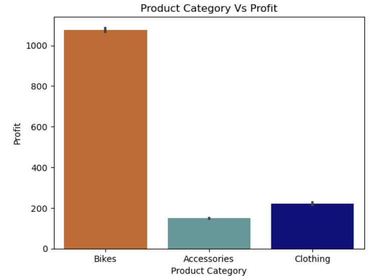

# Customer_Segmentation

## Project Name: Customer Segmentation

### Project Overview:
In marketing and sales, it's crucial to recognize the diversity among customers in terms of preferences, needs, and behaviors. Understanding these differences is key to effectively engaging and reaching out to them. One effective method to achieve this is by segmenting customers based on their age. By doing so, businesses can tailor their marketing strategies to cater to the unique characteristics and preferences of each age group, thereby increasing sales and fostering customer loyalty.

Additionally, in the realm of profitability, a company's value is heavily influenced by its ability to generate high profits. A business that consistently yields substantial profits holds greater value compared to one with lower profitability. The true measure of a company's worth lies in its capacity to generate future profits. Therefore, it's imperative for companies to thoroughly analyze their product offerings and understand which products contribute significantly to their profit margins. This understanding enables businesses to focus their efforts on promoting and optimizing the most profitable products, thereby driving overall profitability and ensuring long-term success.

## Analysis Objective
This analysis is intended to find out the

The effects of different age group on the sales revenue and profit
The product that is generating the highest revenue and Profit

## About the dataset:
The dataset has the following columns

'Date', 'Day', 'Month', 'Year', 'Customer_Age', 'Age_Group', 'Age_Group_NUMBER', 'Customer_Gender', 'Country' 'Product_Category', 'Order_Quantity', 'Unit_Cost', 'Unit_Price', 'Profit', 'Cost', 'Revenue',
#### -- Project Status: [ Completed]

### Methods Used
* Python
* Data Visualization

### Technologies

* Python
* Pandas, jupyter
* Google Sheet

## Needs of this project

- data exploration/descriptive statistics
- statistical modelling
- writeup/reporting
- etc. (be as specific as possible)

# Visulaization

## Customer Gender ratio

## Overall Age_Group distribution

## Age_Group is generating the highest profit

##  Product has the highest quantity order in each age group

## Age_Group distributed in each country

## Country generated the highest revenue

## Product Profit by Country

## The Product Category with the higher Order Quantity have the higher Profit

## Product made the highest profit

## Pgit rofit margin per given product category

### Here are the key findings from the analysis:
The adult age group (35-64) is widely distributed across all countries, while seniors (64+) show the least distribution.

Profit generation varies across different age groups, with the highest profits coming from the adult age group (35-64).

The United States exhibits a significant distribution of all age groups and emerges as the top revenue and profit generator, likely due to its diverse age demographic.

Interestingly, the product category with the highest order quantity doesn't necessarily correlate with the highest sum profit. For instance, the bike category, despite having the lowest order quantity, yields the highest sum profit, likely attributed to its high-profit margin.

### Based on the insights gathered, here are some recommendations for the company:
Tailor Marketing Strategies for Different Age Groups
Utilize social media and influencer marketing to target younger demographics. By customizing marketing messages to cater to the specific preferences and needs of each age group, the company can enhance conversion rates, leading to increased sales.

#### Enhance Customer Loyalty through Personalization:
Offer personalized customer experiences tailored to different age groups. This approach can foster stronger relationships with customers and increase their loyalty to the brand.

#### Improve Engagement with Targeted Marketing:
Craft marketing messages that resonate with each age groups interests and pain points. By addressing the unique needs of different demographics, the company can boost customer engagement and satisfaction.

#### Focus Marketing Efforts on the United States:
Given the highest distribution of all age groups and the highest revenue and profit generation in the United States, prioritize marketing strategies in this market. Allocate resources to capitalize on the strong presence and potential for growth in this region.

#### Maximize Profits by Prioritizing High-Profit Margin Products:
Recognize the significance of profitability in determining the value of the business. Focus on selling products with high-profit margins, such as bikes, to maximize overall profitability and drive future growth.

### [Python Jupytor file](https://github.com/harleen0507/Customer_Segmentation/blob/main/Customer_segmentation.ipynb)
